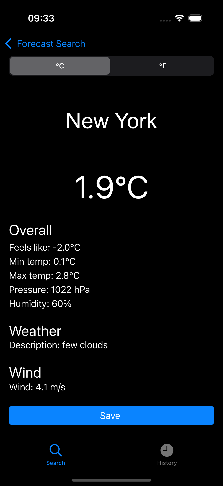
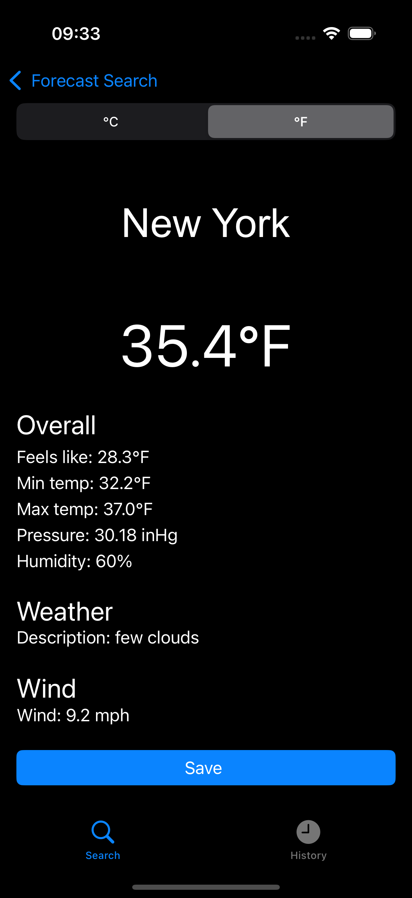
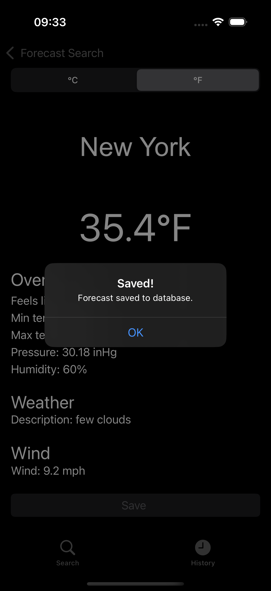
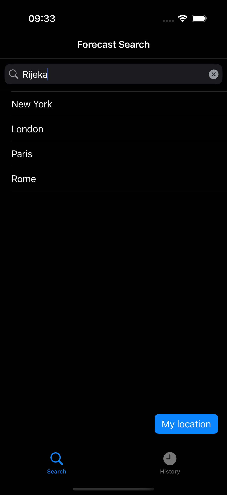
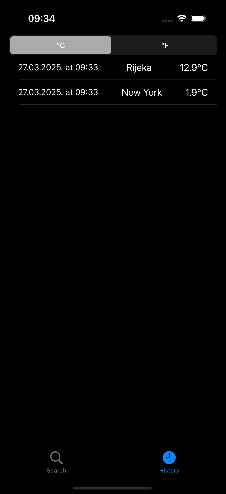
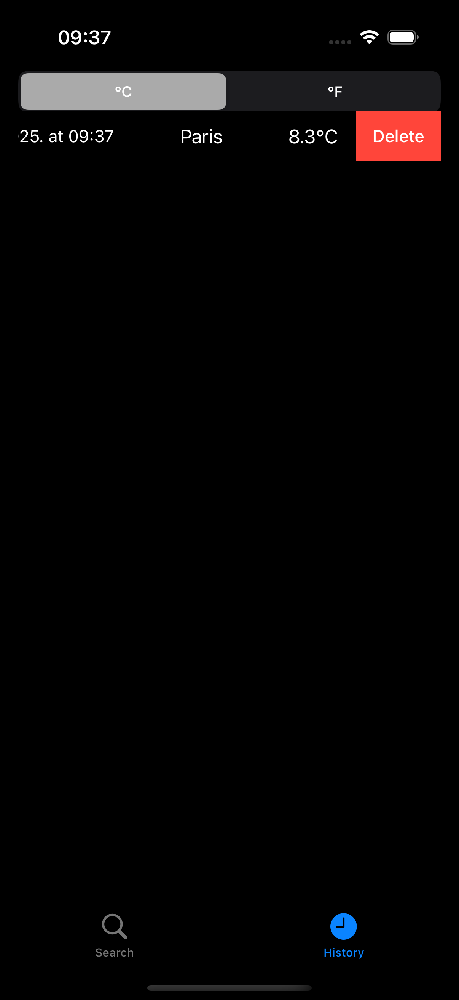
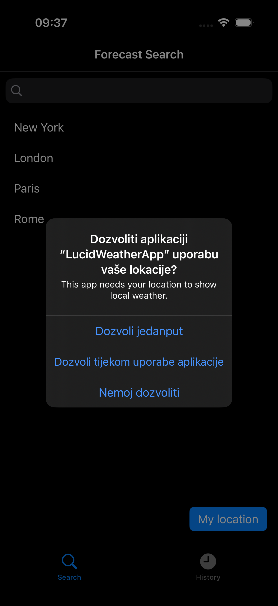

# LucidWeatherApp

LucidWeatherApp is an iOS application built with UIKit, Storyboards, Core Data, and URLSession. The app fetches current weather data from the OpenWeather API and displays it in a user-friendly way. It follows the MVC architecture and uses delegation to separate concerns. Additionally, it features a History tab that saves previous forecasts to Core Data, allowing users to view and delete saved searches.

---

## Features

- **Forecast Tab**
  - Lists four predefined cities.
  - Allows the user to fetch weather data for their current location using Core Location.
  - Provides a search bar to look up weather data by city name.
  - Displays weather details such as temperature, "feels like" temperature, min/max temperatures, wind speed, pressure, and humidity.
  - Uses a UISegmentedControl to switch between Metric and Imperial units.
  - Navigates to a detailed forecast screen via segues.
  
- **History Tab**
  - Displays saved forecasts using Core Data as the data source.
  - Shows each record in the format “date cityName temperature”.
  - Supports swipe-to-delete functionality to remove records from Core Data.

---

## Screenshots

Here are some example screenshots of LucidWeatherApp in action:

### Metric vs. Imperial
 

### Successful Save Alert


### City List and Search


### History Tab


### Deleting a Forecast


### Location Permission Prompt


---

## Technologies & Design Patterns

- **Languages & Frameworks:** Swift, UIKit, Core Data, URLSession, Core Location  
- **Design Patterns:**  
  - **MVC (Model-View-Controller):** Separates the app’s data (Models), UI (Views), and business logic (Controllers).  
  - **Delegation:** Used extensively for handling API responses, location updates, and UITableView events.  
  - **Singleton:** Core Data stack and ApiService are implemented as singletons for centralized data management.  
- **Storyboards & Segues:** The app uses Storyboards for UI design and segues to navigate between screens.

---

## Setup

### Requirements

- Xcode 13 or later  
- iOS 14 or later  
- An OpenWeather API key (register for a free account at [OpenWeather](https://openweathermap.org))

### Installation

1. **Clone the repository:**

   ```bash
   git clone https://github.com/your-username/LucidWeatherApp.git
   cd LucidWeatherApp
   ```

2. **Open the project in Xcode:**

   ```bash
   open LucidWeatherApp.xcodeproj
   ```

3. **Add your API Key:**
   - Create a plist file named `api-key.plist` (if not already included).
   - Add a key `API_KEY` with your OpenWeather API key as its value.
   - Ensure that the plist is included in your project target.

4. **Build and Run:**
   - Select your simulator or device and press `Cmd + R` to build and run the app.

---

## Project Structure

- **Models:**  
  - `WeatherResponse.swift` contains the model definitions (WeatherResponse, Coord, Weather, Main, Wind) for the API response.
- **Networking:**  
  - `ApiService.swift` implements API calls using URLSession.
- **Location & Weather Manager:**  
  - `WeatherManager.swift` handles location updates and fetches weather data using delegation.
- **View Controllers:**  
  - `ForecastViewController.swift` displays the list of cities and provides search functionality.
  - `ForecastDetailsViewController.swift` displays detailed weather data, allows unit conversion (Metric/Imperial), and saving to Core Data.
  - `HistoryViewController.swift` displays saved forecasts using NSFetchedResultsController.
- **Core Data:**  
  - `CoreDataService.swift` manages the Core Data stack as a singleton.
  - Core Data entities (e.g., Forecast) are defined in the `.xcdatamodeld` file.
- **Views:**  
  - Custom table view cells such as `HistoryTableViewCell.swift` and `PlainTableViewCell.swift` are used for displaying data.

---

## Usage

- **Forecast Tab:**  
  - Select a city from the list or use the search bar to look up a city.  
  - Tap the "My Location" button to fetch weather data based on your current location.  
  - The app navigates to the detailed forecast screen where you can view the weather details and switch between Metric and Imperial units.
  
- **Forecast Details:**  
  - View detailed weather information and tap the "Save to Database" button to persist the forecast in Core Data.
  
- **History Tab:**  
  - View all saved forecasts in a table view with the format “date cityName temperature”.  
  - Swipe left on a forecast to delete it.

---

## Error Handling

The app includes error handling that shows alerts in the event of network errors, API failures, or Core Data errors. For example, if a weather fetch fails, an alert is displayed with the error message.

---

## License

This project is licensed under the MIT License – see the [LICENSE](LICENSE) file for details.
```
